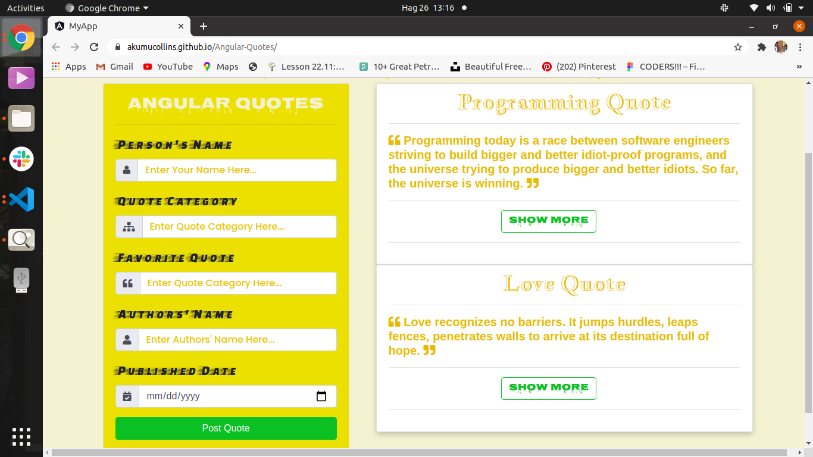

***

# Angular Quotes

#### **Tuesday August 25 2020** ;

***

#### By **Akumu Collins** ;

### Here is the **WebPage Screenshoot** ;

---

## Description
This project allows  to add their own quotes by inputing their username, quote category, their favorite quote, authors' name and date.

## Setup/Installation Requirements
* get the project in github
* copy and  paste the clone link in your terimnal
* git clone https://github.com/Akumucollins/Angular-Quotes.git to your local terminal
* cd to the project directory
* code . /atom . command  to open the text editor

---

## License
The project is [MIT](LICENSE) licensed 

***

This project was generated with [Angular CLI](https://github.com/angular/angular-cli) version 10.0.7.
  
---

## Development server

Run `ng serve` for a dev server. Navigate to `http://localhost:4200/`. The app will automatically reload if you change any of the source files.

***

## Code scaffolding

Run `ng generate component component-name` to generate a new component. You can also use `ng generate directive|pipe|service|class|guard|interface|enum|module`.

---

## Build

Run `ng build` to build the project. The build artifacts will be stored in the `dist/` directory. Use the `--prod` flag for a production build.

***

## Running unit tests

Run `ng test` to execute the unit tests via [Karma](https://karma-runner.github.io).

---

## Running end-to-end tests

Run `ng e2e` to execute the end-to-end tests via [Protractor](http://www.protractortest.org/).

***

## Further help

To get more help on the Angular CLI use `ng help` or go check out the [Angular CLI README](https://github.com/angular/angular-cli/blob/master/README.md).

---
